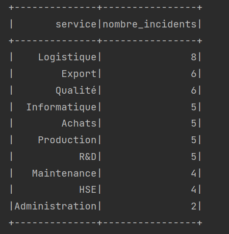
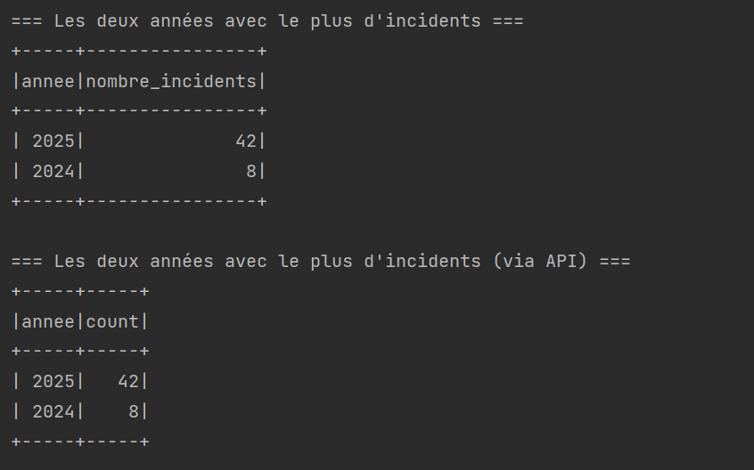

# Analyse d'Incidents Industriels avec Apache Spark SQL

Ce projet démontre l'utilisation d'**Apache Spark SQL** pour analyser des données d'incidents industriels. L'application lit un fichier CSV contenant des incidents et effectue des analyses pour aider à la prise de décision.

---

## Description du Projet

### Analyse des incidents industriels
L'application traite un fichier CSV d'incidents industriels pour calculer :
1. **Le nombre d'incidents par service**
2. **Les deux années où il y avait le plus d'incidents**

**Format du fichier d'entrée :**
```
Id,titre,description,service,date
48634,"Erreur interface","Défaillance du système de refroidissement","Maintenance",2025-04-07
61775,"Arrêt machine","Panne réseau ayant interrompu les communications","Logistique",2025-01-07
```

---


### 1. Nombre d'incidents par service



### 2. Les deux années avec le plus d'incidents




## 📁 Structure du Projet

```
spark-sql-incidents-analysis/
├── src/
│   └── main/
│       └── java/
│           └── net/
│               └── oussama/
│                   └──AnalyseIncidents.java       # Application principale
├── incidents.csv                                   # Données d'incidents générées
└── pom.xml                                         # Configuration Maven
```

---

## Technologies Utilisées

- **Java 11** (compatible avec Spark)
- **Apache Spark 3.5.5**
- **Spark SQL**
- **Maven**

---


##  Fonctionnalités de l'Application

### Analyse des incidents par service
L'application compte le nombre d'incidents par service et affiche les résultats triés par ordre décroissant, permettant d'identifier les services les plus touchés par des incidents.

### Analyse des incidents par année
L'application identifie les deux années avec le plus grand nombre d'incidents, ce qui permet de détecter les tendances temporelles et d'évaluer l'évolution de la fiabilité des systèmes.

---
